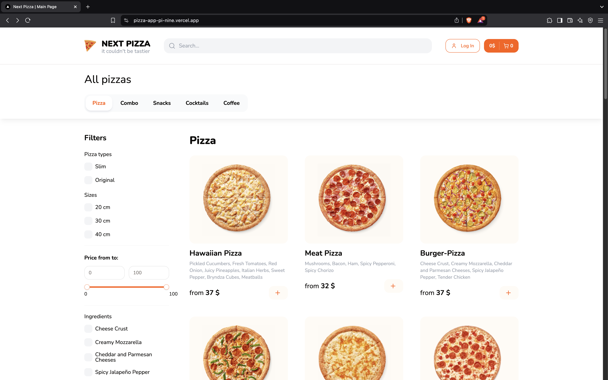
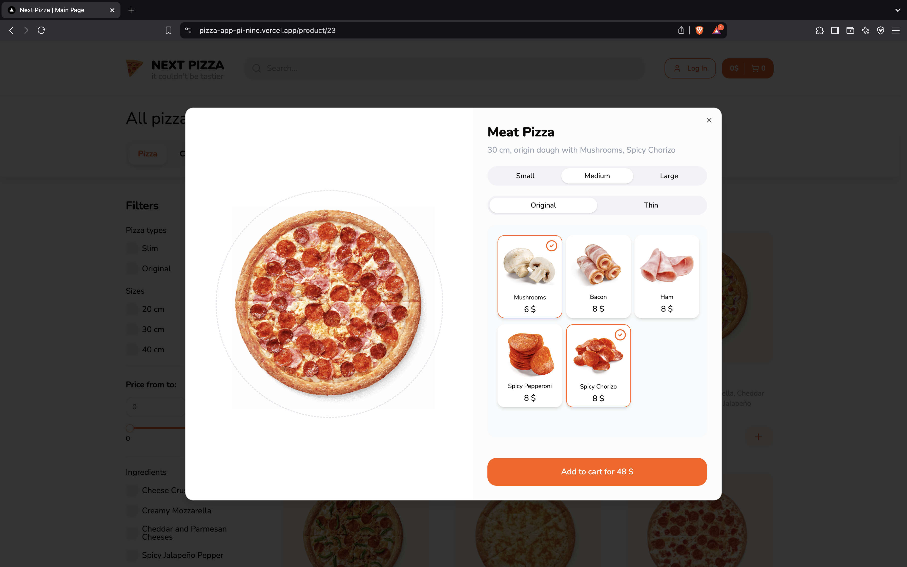
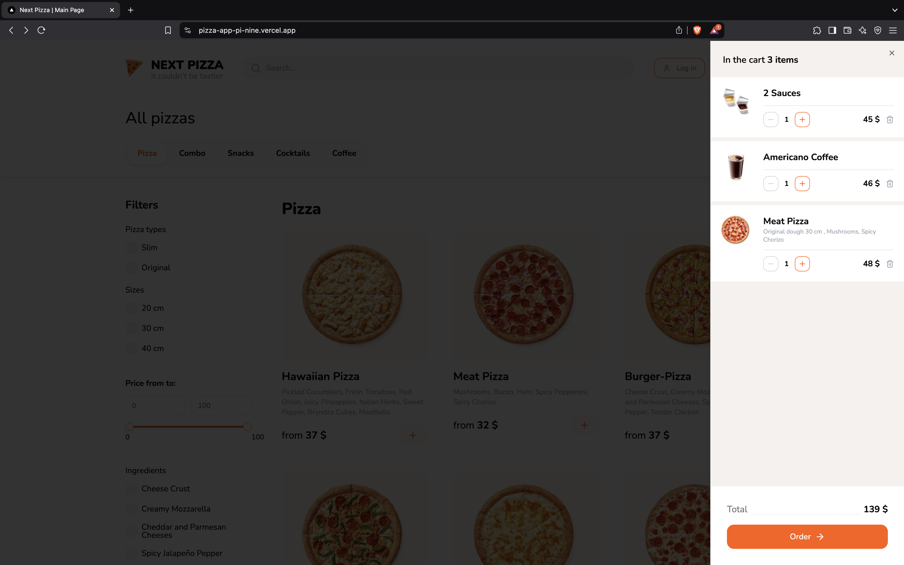
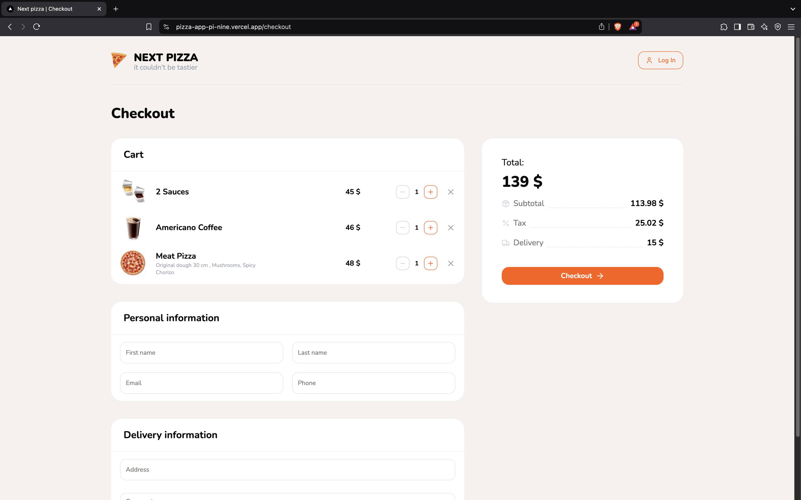
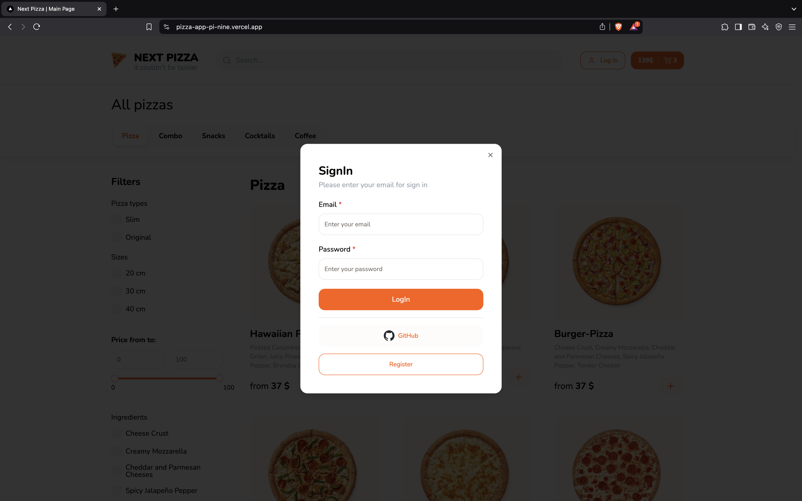

# 🍕 Pizza Ordering App

A high-performance web application for ordering pizza, built with **Next.js 14**, **TypeScript**, and **TailwindCSS**. It features a modern, interactive UI with product filtering, user authentication, shopping cart functionality, and a complete checkout process.

## 🔗 Live Demo

👉 [Check out the live app here](https://pizza-app-pi-nine.vercel.app/)

## 🔥 Key Features

- ✅ **Product Filtering** — Server-side filtering with URL parameter support  
- ✅ **Authentication & Registration** — Login via email/password and GitHub using NextAuth  
- ✅ **Email Verification & Notifications** — Automated emails for registration and orders via Resend  
- ✅ **Flexible Shopping Cart** — Edit items and manage orders before checkout  
- ✅ **Dynamic Product Pages & Modals** — Implemented using Parallel Routes  
- ✅ **Fully Responsive Design** — Styled with TailwindCSS and ShadCN UI  
- ✅ **Deployed on Vercel** — With PostgreSQL + Prisma for database management  

## 💡 What I Learned

- Deep understanding of **server-side and client-side components** in Next.js  
- Implementing **Server Actions**, **Group Routes**, and **Parallel Routes**  
- Managing state globally with **Zustand**  
- Form validation using **React Hook Form + Zod**  
- Integration with third-party services like **Resend**, **react-hot-toast**, and **react-insta-stories**  
- Building reusable components and improving UI/UX with **ShadCN + TailwindCSS**  
- Optimizing database queries and improving performance  

## ⚙️ Tech Stack

| Purpose             | Tech                               |
|---------------------|------------------------------------|
| Framework           | Next.js 14 (App Router)            |
| Language            | TypeScript                         |
| Styling             | TailwindCSS, ShadCN                |
| Forms & Validation  | React Hook Form, Zod               |
| State Management    | Zustand                            |
| Authentication      | NextAuth (Email & GitHub)          |
| Emails              | Resend                             |
| Database            | PostgreSQL + Prisma ORM            |
| UI Enhancements     | react-hot-toast, nextjs-toploader, react-insta-stories, lucide-react |

## 📸 Screenshots

### 🏠 Home Page  

### 🍕 Product Details  

### 🛒 Shopping Cart  

### 💳 Checkout  

### 🔐 Sign In  

